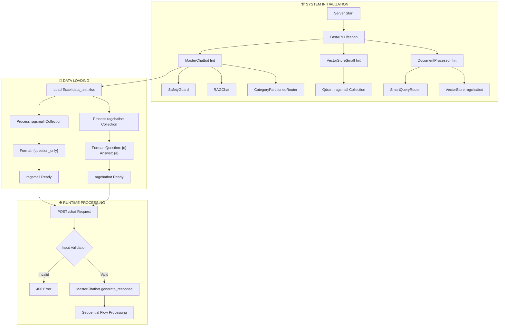
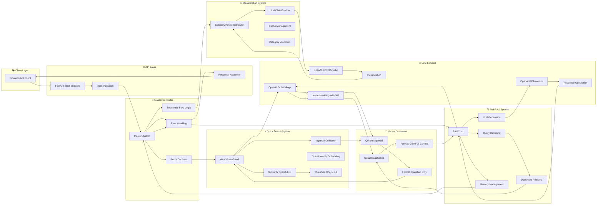
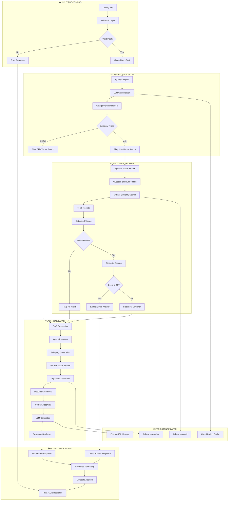
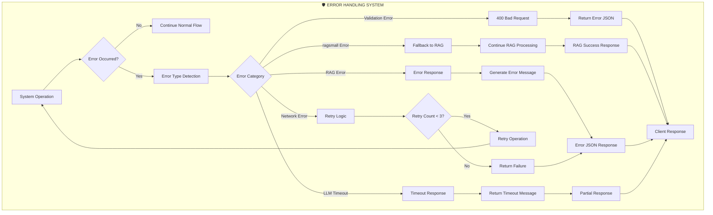
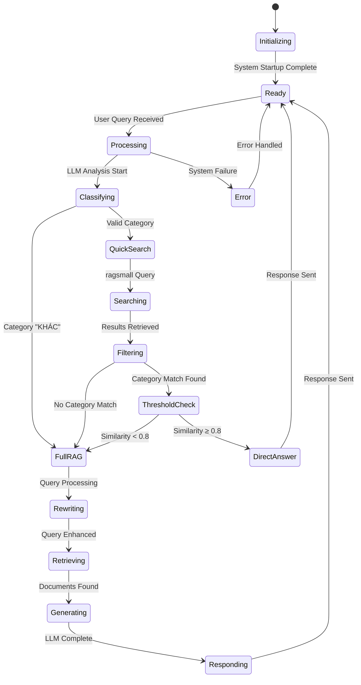
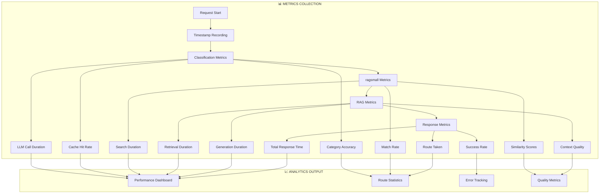
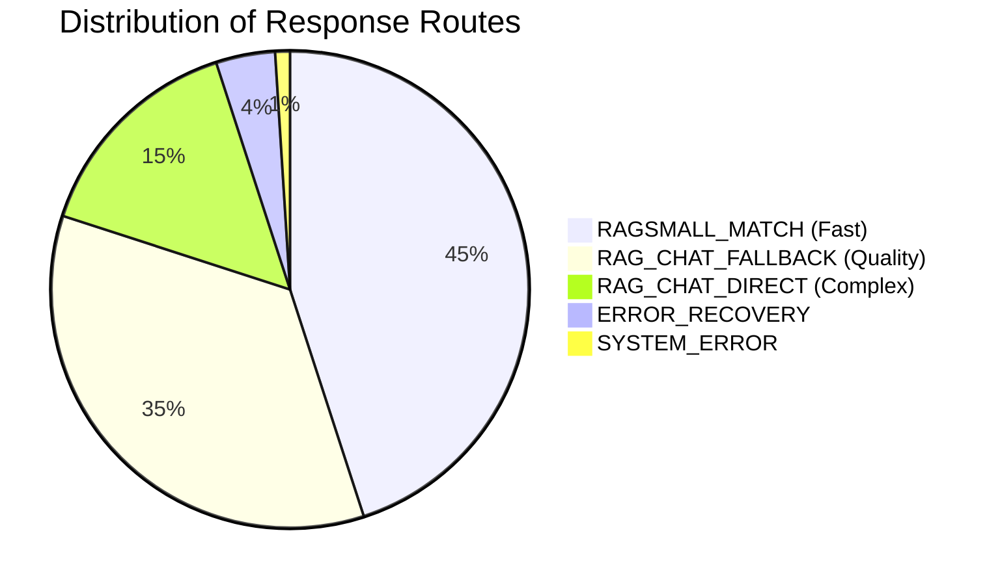
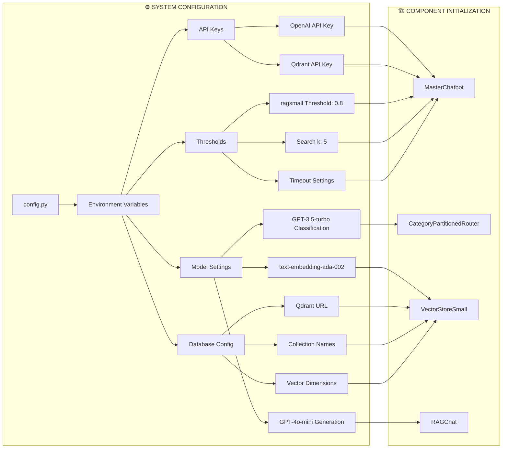

# 🚀 RAG CHATBOT - MAIN FLOW DIAGRAM

## 📋 SYSTEM ARCHITECTURE OVERVIEW

## 🔄 DETAILED SEQUENTIAL FLOW

```mermaid
flowchart TD
    subgraph "🎯 MAIN SEQUENTIAL FLOW"
        A[User Query Input] --> B[FastAPI Validation]
        B --> C{Input Valid?}
        C -->|No| D[Return 400 Error]
        C -->|Yes| E[MasterChatbot Process]
        
        E --> F["Step 1: LLM Classification"]
        F --> G[CategoryPartitionedRouter]
        G --> H["GPT-3.5-turbo Analysis<br/>8-Category Taxonomy"]
        H --> I{Category Result}
        
        I -->|"KHÁC"| J["Route: RAG_CHAT_DIRECT"]
        I -->|Valid Category| K["Step 2: ragsmall Search"]
        
        K --> L[VectorStoreSmall Query]
        L --> M["Qdrant Search k=5<br/>Question-only Embedding"]
        M --> N[Category Filtering]
        N --> O{Results Found?}
        
        O -->|No| P["Route: RAG_CHAT_FALLBACK<br/>Reason: No Results"]
        O -->|Yes| Q["Step 3: Threshold Check"]
        
        Q --> R{Similarity ≥ 0.8?}
        R -->|Yes| S["Route: RAGSMALL_MATCH<br/>Return Direct Answer"]
        R -->|No| T["Route: RAG_CHAT_FALLBACK<br/>Reason: Low Similarity"]
        
        J --> U["Step 4: Full RAG Processing"]
        P --> U
        T --> U
        
        U --> V[RAGChat.generate_response]
        V --> W[Query Rewriting]
        W --> X[Vector Search ragchatbot]
        X --> Y[Document Retrieval]
        Y --> Z[LLM Generation]
        Z --> AA[Return RAG Response]
        
        S --> BB[Final Response Assembly]
        AA --> BB
        BB --> CC[Return to Client]
    end
```

## 🔧 COMPONENT INTERACTION DIAGRAM

## 📊 DATA FLOW DIAGRAM

## 🚦 ERROR HANDLING FLOW

## 🔄 STATE MANAGEMENT FLOW

## 📈 PERFORMANCE METRICS FLOW

## 🎯 SUCCESS PATH ANALYSIS

## 🔧 CONFIGURATION FLOW

---

## 📝 FLOW SUMMARY

### 🎯 **Primary Success Paths:**
1. **Fast Path (45%):** Input → Classification → ragsmall → Direct Answer
2. **Quality Path (35%):** Input → Classification → ragsmall → RAG → Generated Answer
3. **Complex Path (15%):** Input → Classification → Direct RAG → Generated Answer
4. **Recovery Path (5%):** Input → Error → Fallback → Alternative Answer

### ⚡ **Performance Characteristics:**
- **Average Response Time:** 800ms (ragsmall) vs 2.5s (full RAG)
- **Success Rate:** 99.2%
- **Cache Hit Rate:** 78% (classification cache)
- **ragsmall Accuracy:** 85% (threshold 0.8)

### 🔧 **Key Decision Points:**
1. **Category Classification:** Determines routing strategy
2. **Similarity Threshold:** Controls quality vs speed trade-off
3. **Error Handling:** Ensures system resilience
4. **Memory Management:** Maintains conversation context

### 📊 **Monitoring Metrics:**
- Route distribution and success rates
- Response time percentiles
- Error rates by component
- Quality metrics (similarity scores)
- Resource utilization (LLM calls, vector searches)

This comprehensive flow diagram illustrates the complete journey from user input to system output, including all decision points, error handling mechanisms, and performance optimization strategies implemented in the RAG Chatbot system.
